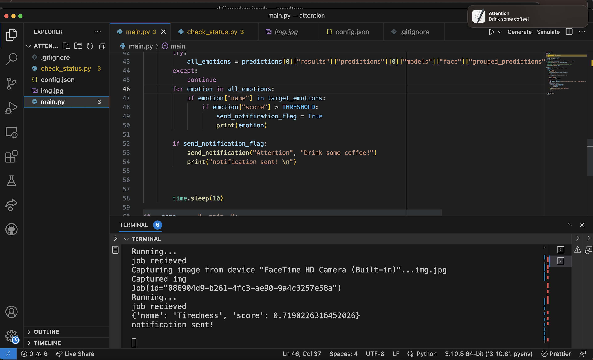

# ATTENTION - Stay Alert with Notifications

## Introduction
Welcome to ATTENTION, a system designed to enhance focus and maintain alertness through timely pop-up notifications. Leveraging the powerful Hume API, ATTENTION monitors your alertness levels and prompts you to take a coffee break when it detects signs of decreased attention.

## Prerequisites
Before you begin, please ensure you have the following:
- Python 3.6 or newer installed on your machine.
- A valid API key from the Hume API.
- Hume package: pip install hume

## Configuration Instructions
To configure the ATTENTION system, please follow these steps:

1. Clone this repository to your local machine.
2. Open the `config.json` file located in the root directory of the project.
3. Replace `Your-API-Key-Here` with your actual Hume API key:
   ```json
   {
     "API_KEY": "Your-API-Key-Here"
   }
## Usage Guide

Execute the main.py script from your command line to start the application:
Upon running, the script will commence interaction with the Hume API and begin issuing notifications based on your alertness analysis.

## Screenshots

Below are screenshots illustrating the main application interface and an example of a notification pop-up.

<p align="center">
  
  <br>
</p>
<p align="center">
  
  <br>
  <em>Example Notification Pop-up</em>
</p>
